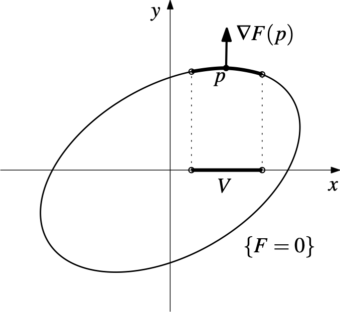
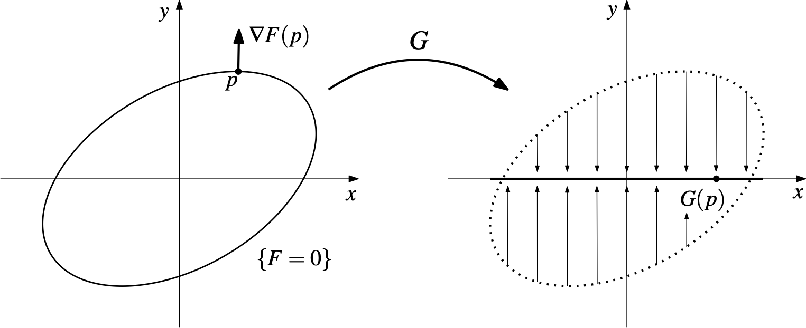

In this post, I will introduce the Implicit Function Theorem through the technique of implicit differentiation from single-variable calculus and prove the well-known fact that gradients are perpendicular to level curves. I first heard about the theorem in my advanced calculus class
and had always wondered about its connection to implicit differentiation. This link finally clicked
when I encountered it in the second volume of Courant's *Differential and Integral Calculus* recently. My proof of the theorem is an adaptation of the ones that I encountered in my classes and readings. I will assume a familiarity with derivatives of multivariable functions and the Inverse Function Theorem. 

## Motivation

Let's begin with a routine problem from calculus I.

> Find the slope of the tangent line to the curve $x^2+3xy+y^2=5$ at the point $(1,1)$.

We learn to solve problems like the one above using implicit differentiation, whereby we assume *implicitly* that $y$ is a function $y(x)$ of $x$ and differentiate with respect to $x$. To demonstrate, we have
$$\begin{align*}
  \frac{d}{dx}\Big(x^2+3xy+y^2\Big) &= \frac{d}{dx}(5)\\
  2x + 3y+ 3x\cdot \frac{dy}{dx} +2y\cdot \frac{dy}{dx} &= 0, 
\end{align*}$$
which implies
$$
  \frac{dy}{dx}= -\dfrac{2x+3y}{3x+2y}.
$$
Plugging in $x=1$ and $y(1)=1$ gives us 
$$
  \frac{dy}{dx}(1) = -\dfrac{2+3}{3+2} = -1.
$$
We can get the same result by solving $x^2+3xy+y^2=5$ for $y$ with the quadratic formula and differentiating with respect to $x$. But in some cases, this isn't always possible and is still a tedious task. As such, implicit differentiation is a real life-saver in these situations. 

But when does it work? Can we always assume that $y$ can be written as a function of $x$?

## The Implicit Function Theorem

The unfortunate answer is "no," but fortunately, the **Implicit Function Theorem** tells us when it's a "yes." The following is a special case of the theorem that is most relevant to our discussion.

> **Theorem** (Implicit Function Theorem)  
> Let $F:U\to \mathbb{R}$ be a continuously differentiable function defined on an open subset $U\subseteq \mathbb{R}^n\times \mathbb{R}$. If $(a,b)\in U$ belongs to the level set $\{F=0\}$ and $\nabla F(a,b)$ is nonzero, then there exists a neighborhood $V\subseteq \mathbb{R}^n$ of $a$ and a continuously differentiable function $f:V\to \mathbb{R}$ such that $(x,f(x))$ belongs to $U$ and $\{F=0\}$ for all $x\in V$.

In other words, if the derivative of $F$ at a point on $\{F=0\}$ does not vanish, then $\{F=0\}$ is locally the graph of a function $f$ near the point. A proof of the theorem is given below, but feel free to skip it for now. 

 

<b>Proof.</b>

Suppose that $F:U\to \mathbb{R}$ is continuously differentiable at $p=(a_1,\dots,a_n,b)\in U$ and $F(p)=0$. We have
$$
  \nabla F(p) = 
  \begin{pmatrix}
    \dfrac{\partial F}{\partial x_1}(p) & \cdots & \dfrac{\partial F}{\partial x_n}(p) & \dfrac{\partial F}{\partial y}(p)
  \end{pmatrix}.
$$
If $\nabla F(p)$ is nonzero, then one of its components is nonzero. Without loss of generality, suppose that $\frac{\partial F}{\partial y}(p)\neq 0$. Now define $G:U\to \mathbb{R}^n\times\mathbb{R}$ by
$$
  G(x_1,\dots,x_n,y) = (x_1,\dots,x_n,F(x_1,\dots,x_n,y)).
$$
The motivation behind $G$ is that it "projects" the level set $\{F=0\}$ onto a hyperplane of $\mathbb{R}^{n}\times\mathbb{R}$ spanned by $n$ coordinate axes, such as in the figure below.

From here, our objective is to recover a portion of $\{F=0\}$ containing $p$ that also happens to be the graph of a real-valued function over the hyperplane. The key tool for this is the Inverse Function Theorem.
Note that the direction that we project $\{F=0\}$ along is very important; in the figure above, projecting $\{F=0\}$ along the $x$-direction will never allow us to realize $\{F=0\}$ around $p$ as the graph of a function over the $y$-axis (the "horizontal line test" always fails). 

By construction, $G$ is also continuously differentiable and 
$$
  DG(p) = 
  \begin{pmatrix}
    1 & \cdots & 0 & 0\\
    \vdots & \ddots & \vdots & \vdots\\
    0 & \cdots & 1 & 0\\[1em]
    \dfrac{\partial F}{\partial x_1}(p) & \cdots & \dfrac{\partial F}{\partial x_{n}}(p) & \dfrac{\partial F}{\partial y}(p)
  \end{pmatrix}.
$$
If we row-reduce the matrix above, we'll find that it has rank $n+1$. Hence, $DG(p)$ is invertible. This is now ripe to apply the Inverse Function Theorem, which gives us 

  * a neighborhood $W\times \widehat{W}\subseteq U$ of $p$,
  * a neighborhood $V\times \widehat{V}\subseteq \mathbb{R}^n\times\mathbb{R}$ of $G(p)$,
  * and an inverse function $G^{-1}$ of $G$ such that $G^{-1}\circ G$ and $G\circ G^{-1}$ are the identities on $W\times \widehat{W}$ and $V\times\widehat{V}$, respectively.

It follows that
$$
\begin{align*}
  (x_1,\dots,x_n,y) &=
  G^{-1}\circ G(x_1,\dots,x_n,y)\\
  &= G^{-1}(x_1,\dots,x_n,F(x_1,\dots,x_n,y)),
\end{align*}
$$
which shows that $y$ is a function of $x_1,\dots,x_n$, and $F(x_1,\dots,x_n,y)$. Let $h$ denote this function, and we have
$$
  y = h(x_1,\dots,x_n,F(x_1,\dots,x_n,y)).
$$
Notice that if $(x_1,\dots,x_n,y)\in W\times \widehat{W}$ lies in $\{F=0\}$, then this reduces to $y=h(x_1,\dots,x_n,0)$, thereby expressing $y$ in terms of $x_1,\dots,x_n$. This observation should motivate us to define $f:V\to \mathbb{R}$ by
$$
  f(x_1,\dots,x_n) = h(x_1,\dots,x_n,0).
$$
It now suffices to confirm that this gives exactly what we want; by construction, $h$ is differentiable on $V\times\widehat{V}$, hence $f$ is differentiable on $V$. If $(x_1,\dots,x_n)\in V$ and we take $y=f(x_1,\dots,x_n)$, then observe that
$$
\begin{align*}
  G^{-1}(x_1,\dots,x_n,0) &= (x_1,\dots,x_n,h(x_1,\dots,x_n,0))\\
  &= (x_1,\dots,x_n, f(x_1,\dots,x_n)),
\end{align*}
$$
which implies
$$
\begin{align*}
  (x_1,\dots,x_n,0) &= G(x_1,\dots,x_n,f(x_1,\dots,x_n))\\
  &= (x_1,\dots,x_n,F(x_1,\dots,x_n,f(x_1,\dots,x_n)))
\end{align*}
$$
and therefore $0 = F(x_1,\dots,x_n,f(x_1,\dots,x_n))$.

In our opening example, the set of points $(x,y)\in\mathbb{R}^2$ satisfying $x^2+3xy+y^2=5$ is equal to the level set $\{F=0\}$ for 
$$ F(x,y) = x^2+3xy+y^2.$$ 
The derivative of $F$ at $(1,1)$ is equal to
$$ \nabla F(1,1) = \begin{pmatrix}2x+3y & 3x+2y\end{pmatrix}\Big|_{(1,1)} = \begin{pmatrix}5 & 5\end{pmatrix},$$
which is surjective because one of the entries is nonzero. And so, the Implicit Function Theorem applies and tells us that $y=f(x)$ for some differentiable function $f$ around $(1,1)$.

## Showing gradients are perpendicular to level curves

An important fact from multivariable calculus is that gradients are pependicular to level sets. We can understand this intuitively in terms of directional derivatives; if $F:\mathbb{R}^n\to \mathbb{R}$ is differentiable at $p\in\mathbb{R}^n$ and $v\in\mathbb{R}^n$ is a unit vector tangent to the level set containing $p$, then the directional derivative of $F$ along $v$ should be $0$ since the value of $F$ does not change on the level set. In other words, we have $\nabla_vF(p) = \nabla F(p)\cdot v=0$, which means $\nabla F(p)$ is orthogonal to all tangent vectors to the level set at $p$. 

We will provide a justification for the case where $n=2$ using the Implicit Function Theorem and present an interesting formula for implicit differentiation. Suppose that $(a,b)\in \{F=0\}$ satisfies the hypothesis of the theorem and $f:V\to \mathbb{R}$ is a differentiable function where $(x,f(x))\in \{F=0\}$ for all $x$ in the neighborhood $V\subseteq \mathbb{R}$ of $a$. Notice that $\gamma(x):= (x,f(x))$ naturally parametrizes the portion of $\{F=0\}$ around $(a,b)$. 
We have $(F\circ\gamma)(x)=0$ for all $x\in V$, so the directional derivative of $F$ along $\gamma$ at $(a,b)$ is equal to
$$
\begin{align*}
  0 = \frac{d}{dx}(F\circ \gamma)(x)\Big|_{a} &= \frac{d}{dx} F(x,f(x))\Big|_a = \nabla F(a,f(a))\cdot 
\begin{pmatrix}
  1\\ f'(a)
\end{pmatrix}.\\
\end{align*}
$$
The velocity vector of $\gamma$ at $(a,b)$ is exactly $(1,f'(a))$, which is parallel to all tangent vectors of $\{F=0\}$ at $(a,b)$. The identity above implies that all tangent vectors—and therefore the level curves—are orthogonal to $\nabla F$ at $(a,b)$. 

But wait, there's more! Expanding the dot product gives us
$$
\begin{align*}
  0 &= \nabla F(a,b)\cdot 
  \begin{pmatrix}
    1\\ f'(a)
  \end{pmatrix}\\
  &= 
  \begin{pmatrix}
    F_x(a,b) & F_y(a,b)
  \end{pmatrix}
  \cdot
  \begin{pmatrix}
    1\\ f'(a)
  \end{pmatrix}\\
  &= F_x(a,b)+F_y(a,b)\cdot f'(a)
\end{align*}
$$
and therefore $f'(a) = -\dfrac{F_x(a,b)}{F_y(a,b)}$. 
To clarify, we used the theorem to guarantee the existence of a one-parameter curve that locally parametrizes the level curve.
The theorem is perhaps not as useful for $n\geq 3$ because we can't parametrize (hyper)surfaces with only one parameter. Additional framework about tangent spaces of surfaces will be necessary for the higher-dimensional case. 

<!-- >

<b>General case of the Implicit Function Theorem</b>

> **Theorem** (Implicit Function Theorem)  
> Let $F:U\to \mathbb{R}^m$ be a continuously differentiable function on an open subset $U\subseteq \mathbb{R}^n\times \mathbb{R}^m$. If $(a,b)\in U$ belongs to the level set $\{F=0\}$ and the derivative $DF(a,b)$ of $F$ is surjective, then there exists a neighborhood $V\subseteq \mathbb{R}^n$ of $a$ and a continuously differentiable function $f:V\to \mathbb{R}^m$ such that $(x,f(x))$ belongs to $U$ and $\{F=0\}$ for all $x\in V$.

-->

## References

 * Manfredo P. do Carmo. Differential Geometry of Curves and Surfaces. Prentice-Hall. 1976.
 * Richard Courant. Differential and Integral Calculus. Vol 2. Wiley Interscience. 1950.

